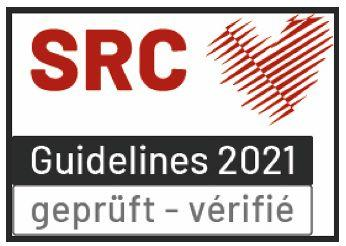

# Formation de base

## BLS-AED-SRC Complet (Fournisseur générique)

Le certificat est validé par le Swiss Resuscitation Council (SRC), et Swiss Defibrillator GmbH est une institution officiellement reconnue et validée par le SRC, comme indiqué sur [www.resuscitation.ch](https://www.resuscitation.ch).

Acquérez des compétences vitales pour les urgences cardiaques, notamment la RCP et l'utilisation du DEA pour les adultes et les enfants.

- Langues : Disponible en anglais, français et allemand.
- Durée : 3 à 4 heures.
- Taille du groupe et prix : Jusqu'à 8 participants, CHF 890.- (forfait, hors TVA).

### Points forts du cours :
- Reconnaître l'arrêt cardiaque, les crises cardiaques, les accidents vasculaires cérébraux et l'obstruction des voies respiratoires
- Effectuer une RCP de haute qualité et une défibrillation par DEA
- Placer une personne inconsciente en position latérale de sécurité
- Gérer les scénarios d'urgence avec des simulations réelles
- Comprendre les aspects juridiques et la chaîne de survie

### Méthodes d'enseignement :
- Exercices pratiques avec des formateurs DEA et des mannequins
- Exercices pratiques et études de cas réels
- Évaluation des compétences individuelles et commentaires

### Qui peut participer ?
- Les professionnels de la santé, les premiers intervenants et toute personne ayant besoin de compétences BLS certifiées.

### Certificat :
- Certificat officiel BLS-AED-SRC Complet, valable 2 ans.
