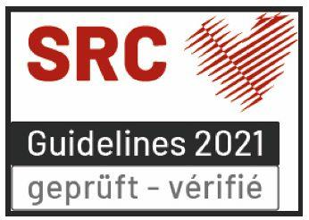

# Refresher Training

## First Aid Level 1 IVR/IAS Refresher Training
Swiss Defibrillator Sàrl is officially recognized and validated by the Swiss Resuscitation Council (SRC). We conduct IAS Level 1 and IAS Level 1 Refresher training in collaboration with BlueFires, an institution recognized, validated, and listed by IVR-IAS for the teaching of IAS 1, IAS 2, and IAS 3. Our certifications are valid for two years, issued by Swiss Defibrillator Sàrl, and recognized by 144.ch, ensuring high-quality, standards-compliant training.

- Languages: Available in English, French, and German.

### Course Content:
- BLS-AED-SRC Complete (Generic Provider)
- Review of First Aid Level 1 IVR/IAS topics
- Teaching materials provided

> "The IAS IVR 1 certificate must not be older than 24 months.

### Requirements:
> Participants must hold a valid IVR/IAS Level 1 certificate that is no more than 48 months old."

### Duration & Price:
- Duration: 7 hours
- Group Size: Up to 8 participants
- Price: CHF 1,470.- (excl. VAT) per group
